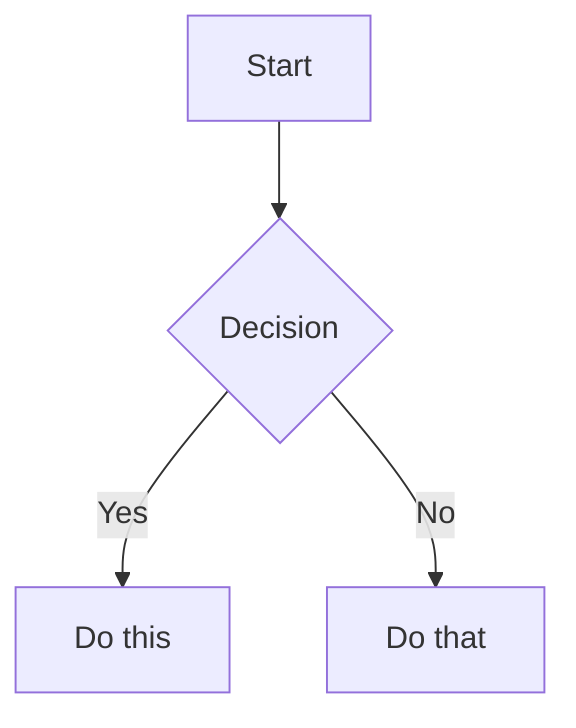

# md2docx

[](https://go.dev)
[](./LICENSE)
[](https://github.com/Aknirex/md2docx/releases/latest)
[](https://github.com/Aknirex/md2docx/actions)
[]()

Convert Markdown to professional DOCX documents — dependency-free, no Word or Pandoc required.

Built in Go. Distributed as a single static binary with no runtime dependencies.

[English](./README.md) | [简体中文](./docs/README.zh-CN.md) | [日本語](./docs/README.ja.md) | [한국어](./docs/README.ko.md) | [Español](./docs/README.es.md) | [Português](./docs/README.pt-BR.md) | [Deutsch](./docs/README.de.md) | [Français](./docs/README.fr.md)

## Quick Start

### Interactive TUI (for humans)

```bash
md2docx
```

A terminal UI with arrow-key navigation:
- Select Markdown input file
- Choose output location and filename
- Pick a built-in style preset (US, CN, JP, EU, KR, Academic) or a custom JSON template
- Confirm and convert

### CLI (for agents / automation)

```bash
# Convert with defaults
md2docx convert -i notes.md -o notes.docx --json

# Convert with a country-specific preset
md2docx convert -i report.md -o report.docx -s cn-official --json

# List all presets
md2docx presets --json

# Create a custom template from a preset
md2docx template create -o my-style.json -s jp-formal

# Convert with a custom template
md2docx convert -i doc.md -o doc.docx -s my-style.json --json

# Convert with Mermaid diagrams rendered as embedded PNG images
md2docx convert -i doc.md -o doc.docx --mermaid --json
md2docx convert -i doc.md -o doc.docx --mermaid --mermaid-theme dark --json
```

The `--json` flag produces structured JSON suitable for agent consumption:
```json
{"success": true, "outputPath": "/path/to/output.docx", "bytes": 12345}
```

## Installation

### Via Go

```bash
go install github.com/Aknirex/md2docx/cmd/md2docx@latest
```

### Pre-built binaries

Download from [GitHub Releases](https://github.com/Aknirex/md2docx/releases) for:
- Linux (amd64, arm64)
- macOS (amd64, arm64)
- Windows (amd64)

### Package managers

```bash
# Homebrew
brew install md2docx/homebrew-tap/md2docx

# Debian/Ubuntu
dpkg -i md2docx_*.deb

# RPM
rpm -i md2docx_*.rpm
```

## Built-in Style Presets

| Preset       | Region  | Fonts                                   |
|-------------|---------|------------------------------------------|
| us-business | US      | Cambria / Calibri / Consolas            |
| us-modern   | US      | Segoe UI / Cascadia Code                |
| cn-official | China   | 小标宋_GBK / 仿宋_GB2312 / 楷体_GB2312（公文风格） |
| cn-modern   | China   | Noto Sans SC / Noto Sans Mono SC        |
| jp-formal   | Japan   | Yu Mincho / Yu Gothic                   |
| eu-clean    | Europe  | Helvetica / Arial / Fira Code           |
| kr-standard | Korea   | Malgun Gothic / Nanum Gothic / D2Coding |
| academic    | Global  | Times New Roman / Courier New           |
| default     | Global  | Aptos Display / Cascadia Mono           |

## Agent Skill

md2docx includes a SKILL.md so AI coding agents (Kilo, Claude Code, etc.) can discover and invoke it automatically.

**Install via npx skills:**

```bash
npx skills add Aknirex/md2docx
```

After installation, agents will know how to invoke `md2docx convert -i <input> -o <output> --json` for markdown-to-docx conversions.

## Style Templates

Custom style templates are JSON files:

```json
{
  "titleFont": "Arial",
  "titleSize": 28,
  "headingFont": "Arial",
  "headingSize": 16,
  "bodyFont": "Times New Roman",
  "bodySize": 12,
  "codeFont": "Courier New",
  "codeSize": 10,
  "textColor": "#1F2937",
  "accentColor": "#2563EB",
  "pageMarginInches": 1.0
}
```

Create one from a preset:
```bash
md2docx template create -o my-style.json -s default
```

## Supported Markdown

- Headings (h1–h6)
- Paragraphs
- Unordered lists (`-`, `+`, `*`)
- Ordered lists (`1.`, `1)`)
- Blockquotes (`>`)
- Fenced code blocks (` ``` `)
- **Bold**, *italic*, `inline code`

## Mermaid Diagram Rendering

Mermaid code blocks are rendered as embedded PNG images when `--mermaid` is enabled:

````markdown

````

Uses [mermaid.ink](https://mermaid.ink) by default (public, free API). Configure with:
- `--mermaid` — enable Mermaid rendering
- `--mermaid-theme` — `default`, `neutral`, `dark`, or `forest`
- `--mermaid-server` — custom self-hosted mermaid.ink instance

In the TUI, toggle Mermaid rendering on the confirm screen.

## Build from Source

```bash
git clone https://github.com/Aknirex/md2docx
cd md2docx
go mod tidy
make build
```

## License

MIT
